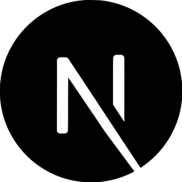
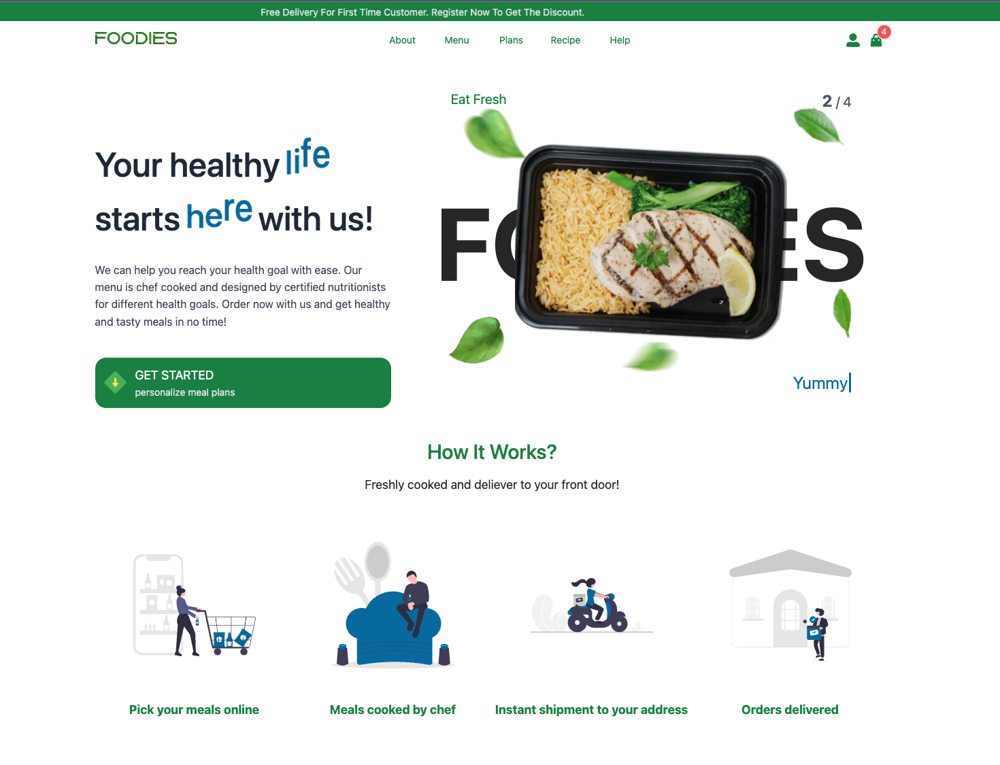
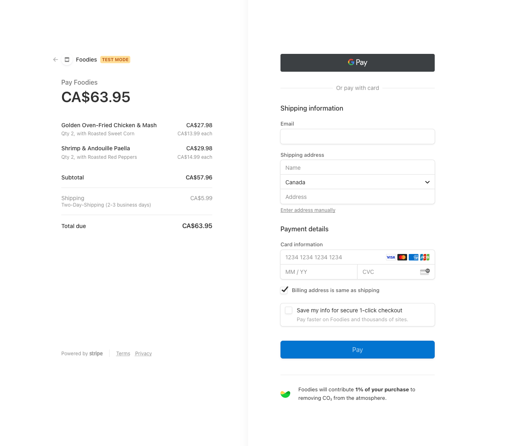
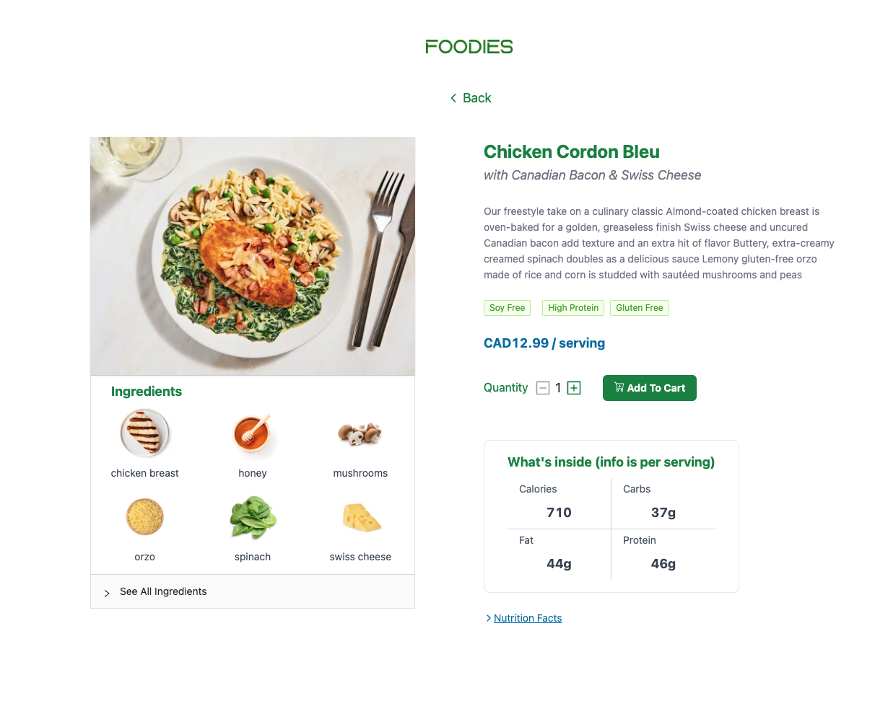
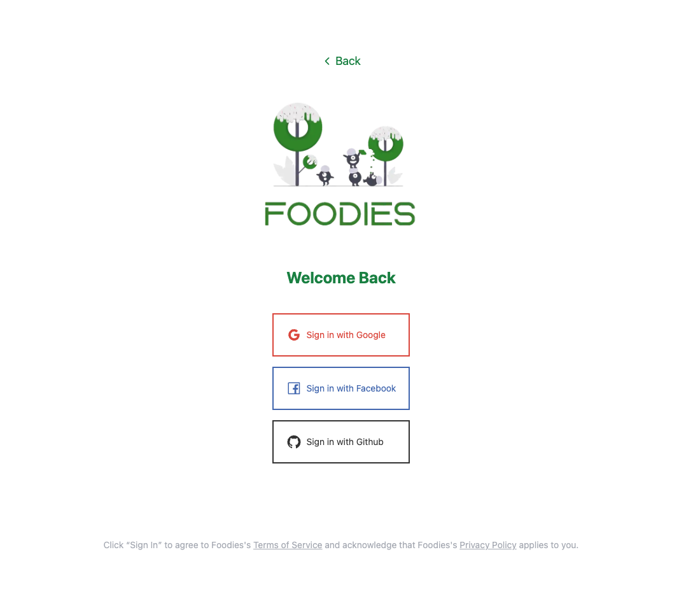
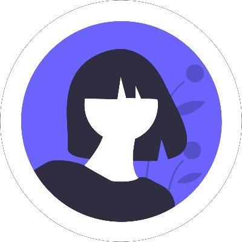
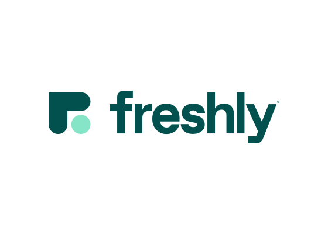

# Foodies (E-commerce)

[https://foodies-pi.vercel.app/](https://foodies-pi.vercel.app/)

## The website

<p float="left">
    
    
    
    
    
    
    
</p>

- Built with redux, react, nextjs, tailwindcss, stripe, mongodb, next-auth.
- A variant of MERN stack except this website is using nextjs built in api instead of ExpressJS.
- Supports OAuth login and Stripe checkout session
- Fully responsive website
- All animations and transitions are aniamted by framer-motion

To test out checkout session, use test card number 4242 4242 4242 4242, a random three-digit CVC number, and any expiration date in the future will be accepted.

## Pages Demo






## Project Structure

```
$PROJECT_ROOT
│   # Page files
├── pages
│   # React component files
├── components
│   # Non-react modules
├── dist
│   # compiled tailwindcss style sheet
├── utils
│   # helper functions
├── redux
│   # redux reduces, slicers and action creators
├── hooks
│   # custom react hooks
└── public
```

## Materials

- [](https://ant.design/) Ant design - A nice component library for React
- [](https://undraw.co/) Undraw - A picture library for ui design
- [](https://react-icons.github.io/react-icons) React Icons - An icon component library for React

## Data

[](https://www.freshly.com/)

All testing data and product images are come from [Freshly](https://www.freshly.com/). If you are interested in their products, please check out their website. This website is only for learning purpose. No sensitive data will be recorded in this website.
